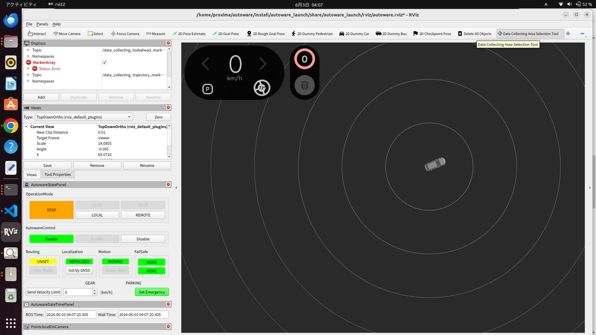
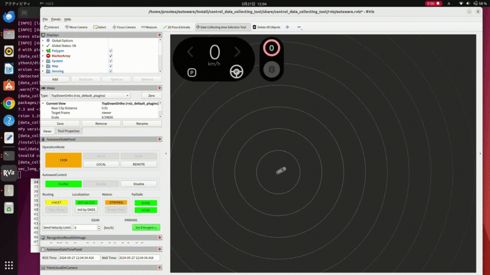
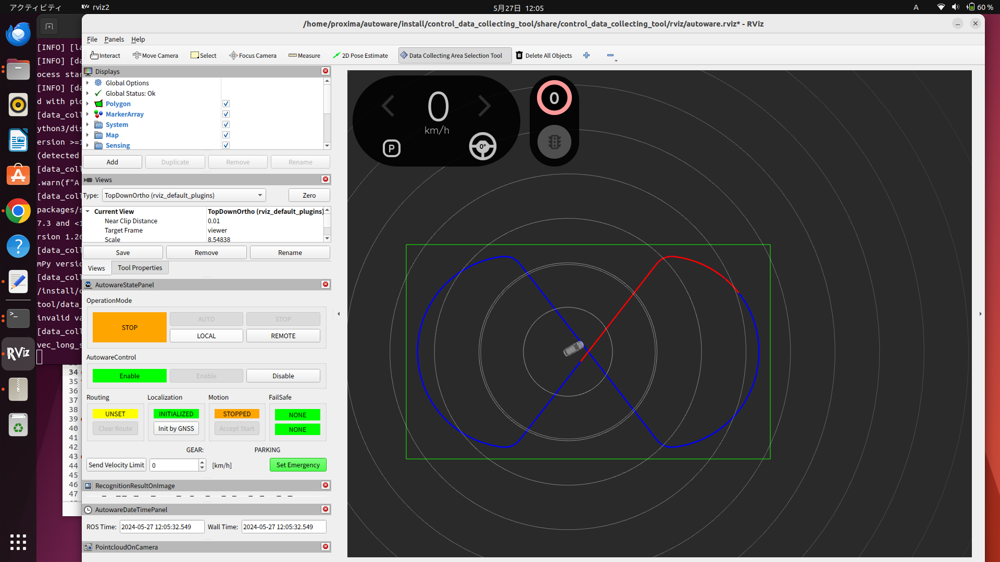

# Control data collecting tools

This package provides tools for automatically collecting data using pure pursuit control within a specified rectangular area.


## How to use

1. Launch Autoware.

```bash
source ~/autoware/install/setup.bash
ros2 launch autoware_launch planning_simulator.launch.xml rviz_config:=$(ros2 pkg prefix control_data_collecting_tool)/share/control_data_collecting_tool/rviz/autoware.rviz map_path:=$HOME/autoware_map/sample-map-planning vehicle_model:=sample_vehicle sensor_model:=sample_sensor_kit
```

2. Set an initial pose, see [here](https://autowarefoundation.github.io/autoware-documentation/main/tutorials/ad-hoc-simulation/planning-simulation/#2-set-an-initial-pose-for-the-ego-vehicle)

3. Launch control_data_collecting_tool.

```bash
source ~/autoware/install/setup.bash
ros2 launch control_data_collecting_tool control_data_collecting_tool.launch.py
```

4. Select the data collecting area using `DataCollectingAreaSelectionTool` plugin.
   
   

> [!NOTE]
> You cannot change the data collecting area while driving.

5. Start data collecting by clicking the `LOCAL` button on `OperationMode` in `AutowareStatePanel`.
   
   

## Parameter

Ros2 params in `/data_collecting_trajectory_publisher` node:

| Name                                     | Type     | Description                                                           | Default value |
| :--------------------------------------- | :------- | :-------------------------------------------------------------------- | :------------ |
| `max_lateral_accel`                      | `double` | Max lateral acceleration limit [m/ss]                                 | 0.5           |
| `Moving average smoothing window size`   | `int`    | Moving average smoothing window size                                  | 50            |
| `mov_ave_window`                         | `double` | Target longitudinal velocity [m/s]                                    | 3.0           |
| `longitudinal_velocity_noise_amp`        | `double` | Target longitudinal velocity additional sine noise amplitude [m/s]    | 0.1           |
| `longitudinal_velocity_noise_min_period` | `double` | Target longitudinal velocity additional sine noise minimum period [s] | 5.0           |
| `longitudinal_velocity_noise_max_period` | `double` | Target longitudinal velocity additional sine noise maximum period [s] | 20.0          |

Ros2 params in `/data_collecting_pure_pursuit_trajectory_follower` node:

| Name                                  | Type     | Description                                            | Default value |
| :------------------------------------ | :------- | :----------------------------------------------------- | :------------ |
| `wheel_base`                          | `double` | Wheel base [m]                                         | 2.79          |
| `pure_pursuit_acc_kp`                 | `double` | Pure pursuit accel command propotional gain            | 0.5           |
| `naive_pure_pursuit_lookahead_length` | `double` | Pure pursuit (naive version) lookahead length [m]      | 5.0           |
| `acc_noise_amp`                       | `double` | Accel command additional sine noise amplitude [m/ss]   | 0.01          |
| `acc_noise_min_period`                | `double` | Accel command additional sine noise minimum period [s] | 5.0           |
| `acc_noise_max_period`                | `double` | Accel command additional sine noise maximum period [s] | 20.0          |
| `steer_noise_amp`                     | `double` | Steer command additional sine noise amplitude [rad]    | 0.01          |
| `steer_noise_max_period`              | `double` | Steer command additional sine noise maximum period [s] | 5.0           |
| `steer_noise_min_period`              | `double` | Steer command additional sine noise minimum period [s] | 20.0          |
